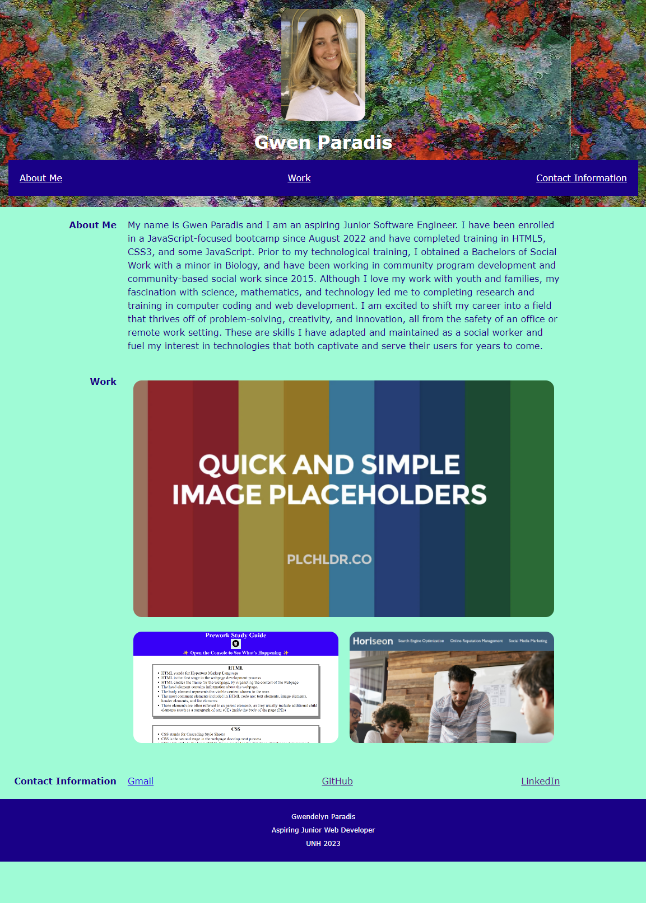

#02-Week-Challenge (Portfolio)

## Description

I created this portfolio in order to begin to showcase my work as a web developer and increase my chances of employment. This project showcases the skills that I have learned in Advanced CSS, as well as other projects that are linked in the Work section. This allows my work to be accessed quickly and easily from one location. I learned how to apply Advanced CSS to a functional webpage.

## Installation

This webpage can be accessed on Github Pages, at the link: https://gwenparadis.github.io/02-week-challenge/

## Usage

Once the webpage is active, you can utilize the navigation links in the dark blue header (see screenshot) to navigate to the different sections of the portfolio: About Me, Work, Contact Information. In the About Me section, you will learn about how my career has led me to work in web development. In  the Work section, you will see screenshots of my past projects. Clicking on these images will bring you to the corresponding deployed webpages. In the Contact Information section, you will see links to my email, GitHub, and LinkedIn for direct contact to my professional portfolios on different platforms. Feel free to utilize these links to inquire further about the content in the webpage.

## Credits

NA

## License

NA
